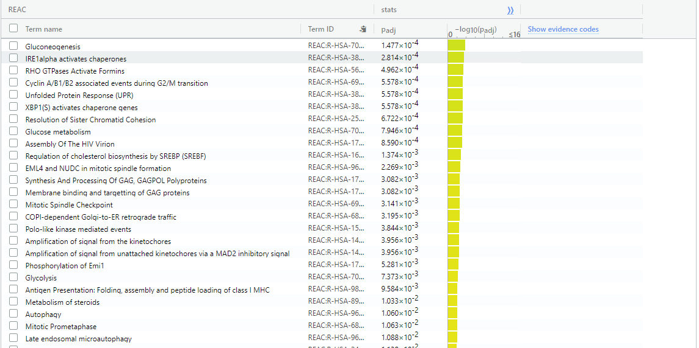

Name: Yuzi Li  
Student Number: 1005131947  

***

Install packages: 
```{r, message = FALSE, warning=FALSE}
if (!requireNamespace("BiocManager", quietly = TRUE))
  install.packages("BiocManager")
if (!requireNamespace("GEOmetadb", quietly = TRUE))
  BiocManager::install("GEOmetadb")
if(!requireNamespace("edgeR", quietly = TRUE))
  BiocManager::install("edgeR")
if(!requireNamespace("biomaRt", quietly = TRUE))
  BiocManager::install("biomaRt")
if(!requireNamespace("ComplexHeatmap", quietly = TRUE))
  BiocManager::install("ComplexHeatmap")
if(!requireNamespace("circlize", quietly = TRUE))
  install.packages("circlize")

library(GEOmetadb)
library(edgeR)
library(biomaRt)
library(ComplexHeatmap)
library(circlize)
```

***

# Summary of normalization results from assignment 1

<br>

### Loading data

Data was downloaded from GEO with id GSE161243. 

```{r, message = FALSE, warning=FALSE}
# Set GSEMatrix to FALSE to get other columns from the GSE records
gse <- getGEO("GSE161243", GSEMatrix=FALSE)
# Get platform info from GSE161243
current_gpl <- names(GPLList(gse))[1]
current_gpl_info <- Meta(getGEO(current_gpl))
# Get expression data (gene raw counts) from supplementary files
supp_files = getGEOSuppFiles('GSE161243')
file_names = rownames(supp_files)
# There is only one supplemental file
# Set check.names to false so the column names are not automatically reformatted
cpt1a_exp = read.delim(file_names[1], header=TRUE, check.names=FALSE)
```

<br>

### Defining sample groups

2 gene expression experiments were conducted in the study, one on identifying the effect of CPT1A gene knockdown in LNCaP-C4-2 prostate cancer cells, the other identifying the effect of CPT1A gene overexpression in prostate cancer cells. The replicates of the same control/test conditions are assigned the same cell_type in the samples data frame: “KD_C”, “KD_S”, “OE_C”, “OE_S”, with “KD” standing for knockdown and “OE” standing for overexpression. “_C” are control samples, and “_S” are experimental samples. These 4 different cell types were indicated for TMM normalization.

```{r, message = FALSE, warning=FALSE}
# Rename sample names
colnames(cpt1a_exp)[2:11] <- c("KD_C1", "KD_C2", "KD_S1", "KD_S2", "KD_S3", "OE_C1", "OE_C2", "OE_S1", "OE_S2", "OE_S3")
# Define sample groups
samples <- data.frame(cell_type = unlist(lapply(colnames(cpt1a_exp)[2:11], 
                                         FUN=function(x){substr(x, 1, 4)})))
samples <- cbind(samples, sample_number = c(1:10))
rownames(samples) <- colnames(cpt1a_exp)[2:11]
samples
```

<br>

### Filtering data

No duplicated genes were discovered in the dataset.  

Genes with low counts are filtered out. 

```{r, message = FALSE, warning=FALSE}
# Translate out counts into counts per million using the edgeR package
cpms = cpm(cpt1a_exp[, 2:11])
rownames(cpms) <- cpt1a_exp[, 1]
# Get rid of low counts
keep = rowSums(cpms > 1) >= 10
cpt1a_exp_filtered = cpt1a_exp[keep, ]
# Transform dataframe counts to matrix
filtered_data_matrix <- as.matrix(cpt1a_exp_filtered[, 2:11])
rownames(filtered_data_matrix) <- cpt1a_exp_filtered$Gene
```

**Number of removed genes**: `r length(cpt1a_exp$Gene) - dim(cpt1a_exp_filtered)[1]`  
**Number of remaining genes**: `r dim(cpt1a_exp_filtered)[1]`  

<br>

### Normalization results

Created density plots and box plots of the data set before and after TMM normalization:  


Created MDS plot to inspect sample separation. The sample groups data appear to be well separated, and there appears to be low technical variation:  


***

<br> <br>

# Differential gene expression analysis

I analyzed differential expression of genes separately for the overexpression and knockdown experiments as they were done under slightly different conditions with different control groups.  

<br>

### Calculating p-values

Calculating p-values for the knockdown experiment: 

```{r, message = FALSE, warning=FALSE}
# Create a container for expression count data for knockdown experiment
data_kd = DGEList(counts=filtered_data_matrix[, 1:5], group=samples$cell_type[1:5])
# Create model
model_design_pat_kd <- model.matrix(~ samples$cell_type[1:5])
#estimate dispersion
data_kd <- estimateDisp(data_kd, model_design_pat_kd)
#calculate normalization factors
data_kd <- calcNormFactors(data_kd)
#fit model
fit_kd <- glmQLFit(data_kd, model_design_pat_kd)
#calculate differential expression
qlf_kd <- glmQLFTest(fit_kd)
qlf_hits_kd <- topTags(qlf_kd, sort.by = "PValue", adjust.method = "BH", n = nrow(filtered_data_matrix))
```

**Number of genes pass p < 1e-7 in CPT1A knockdown**: `r length(which(qlf_hits_kd$table$PValue < 1e-7))`  
**Number of genes pass correction in CPT1A knockdown**: `r length(which(qlf_hits_kd$table$FDR < 1e-7))`  
**Number of up-regulated genes in CPT1A knockdown**: `r length(which(qlf_hits_kd$table$FDR < 1e-7 & qlf_hits_kd$table$logFC > 0))`  
**Number of down-regulated genes in CPT1A knockdown**: `r length(which(qlf_hits_kd$table$FDR < 1e-7 & qlf_hits_kd$table$logFC < 0))`  

Calculating p-values for the overexpression experiment: 

```{r, message = FALSE, warning=FALSE}
# Create a container for expression count data for knockdown experiment
data_oe = DGEList(counts=filtered_data_matrix[, 6:10], group=samples$cell_type[6:10])
# Create model
model_design_pat_oe <- model.matrix(~ samples$cell_type[6:10])
#estimate dispersion
data_oe <- estimateDisp(data_oe, model_design_pat_oe)
#calculate normalization factors
data_oe <- calcNormFactors(data_oe)
#fit model
fit_oe <- glmQLFit(data_oe, model_design_pat_oe)
#calculate differential expression
qlf_oe <- glmQLFTest(fit_oe)
qlf_hits_oe <- topTags(qlf_oe, sort.by = "PValue", adjust.method = "BH", n = nrow(filtered_data_matrix))
qlf_hits_kd <- qlf_hits_kd[[1]]
qlf_hits_oe <- qlf_hits_oe[[1]]
```

**Number of genes pass p < 1e-7 in CPT1A overexpression**: `r length(which(qlf_hits_oe$PValue < 1e-7))`  
**Number of genes pass correction in CPT1A overexpression**: `r length(which(qlf_hits_oe$FDR < 1e-7))`  
**Number of up-regulated genes in CPT1A overexpression**: `r length(which(qlf_hits_oe$FDR < 1e-7 & qlf_hits_oe$logFC > 0))`  
**Number of down-regulated genes in CPT1A overexpression**: `r length(which(qlf_hits_oe$FDR < 1e-7 & qlf_hits_oe$logFC < 0))`  

Here I used a very stringent p-value threshold (1e-7) because there are many differentially expressed genes even with this strict threshold. By using a strict threshold, I want to only look at the genes that we most confidently know are differentially expressed. This is also because G:Profiler cannot run properly on a gene list query that is too large.  

I also defined the differentially expressed genes as the ones that pass correction.  

I used the benjamini-hochberg method for p-value correction because it is not overly stringent and is the standard method.  

<br>

### Volcano plot

Build volcano plot for knockdown experiment: 

```{r, message = FALSE, warning=FALSE, fig.cap="Volcano plot for CPT1A knockdown experiment samples"}
# Assign colours to genes: up-regulated is red, down-regulated is blue
colours <- vector(mode="character", length=nrow(qlf_hits_kd))
colours[] <- 'grey'
colours[qlf_hits_kd$logFC < 0 & qlf_hits_kd$FDR < 1e-7] <- 'blue'
colours[qlf_hits_kd$logFC > 0 & qlf_hits_kd$FDR < 1e-7] <- 'red'
colours[row.names(qlf_hits_kd) == "CPT1A"] <- 'green'

# Make plot
plot(qlf_hits_kd$logFC,
     -log(qlf_hits_kd$PValue, base=10),
     col = colours,
     xlab = "logFC",
     ylab ="-log(p-value)", 
     main="CPT1A Knockdown Volcano Plot")

# Create legend
legend(2.5, 5, legend=c("down-regulated genes","up-regulated genes", "non-significant", "CPT1A"),
       fill = c("blue", "red", "grey", "green"), cex = 0.6)
```

<br>

This Volcano plot is as expected as the CPT1A expression is significantly lower in the knock-down samples.  

Build volcano plot for overexpression experiment: 

```{r, message = FALSE, warning=FALSE, fig.cap="Volcano plot for CPT1A overexpression experiment samples"}
# Assign colours to genes: up-regulated is red, down-regulated is blue
colours <- vector(mode="character", length=nrow(qlf_hits_oe))
colours[] <- 'grey'
colours[qlf_hits_oe$logFC < 0 & qlf_hits_oe$FDR < 1e-7] <- 'blue'
colours[qlf_hits_oe$logFC > 0 & qlf_hits_oe$FDR < 1e-7] <- 'red'
colours[row.names(qlf_hits_oe) == "CPT1A"] <- 'green'

# Make plot
plot(qlf_hits_oe$logFC,
     -log(qlf_hits_oe$PValue, base=10),
     col = colours,
     xlab = "logFC",
     ylab ="-log(p-value)", 
     main="CPT1A Overexpression Volcano Plot")

# Create legend
legend(1.8, 7, legend=c("down-regulated genes","up-regulated genes", "non-significant", "CPT1A"),
       fill = c("blue", "red", "grey", "green"), cex = 0.6)
```

<br>

This Volcano plot is as expected as the CPT1A expression is significantly higher in the overexpression samples.  

<br> 

### Heat map

Create heat map for knockdown experiment:

```{r, message = FALSE, warning=FALSE, fig.cap="Heat map for CPT1A knockdown experiment samples"}
# Get top hit gene names
top_hits_kd <- rownames(qlf_hits_kd)[qlf_hits_kd$PValue < 1e-7]
# Calculate logCPM
hm_matrix_kd <- log2(filtered_data_matrix[, 1:5] + 1)
# Scale heat map matrix by rows
hm_matrix_kd_top <- t(scale(t(hm_matrix_kd[rownames(hm_matrix_kd) %in% top_hits_kd, ])))

# Create color ramps
if(min(hm_matrix_kd_top) == 0){
    heatmap_col = colorRamp2(c( 0, max(hm_matrix_kd_top)), 
                             c( "white", "red"))
  } else {
    heatmap_col = colorRamp2(c(min(hm_matrix_kd_top), 0, max(hm_matrix_kd_top)), c("blue", "white", "red"))
  }

# Create heatmap
Heatmap(as.matrix(hm_matrix_kd_top),
        cluster_rows = TRUE, show_row_dend = TRUE,
        cluster_columns = TRUE, show_column_dend = TRUE,
        col=heatmap_col, show_column_names = TRUE, 
        show_row_names = FALSE, show_heatmap_legend = TRUE, 
        column_title = "CPT1A kockdown experiment samples")
```

<br>

From the heat map, I can see that the conditions cluster together: the knockdown samples (KD_S1, KD_S2, KD_S3) are in their own cluster, and the control samples (KD_C1, KD_C2) are also in a cluster. There is a clear contrast between different conditions, and there is also clear contrast between up-regulated and down-regulated genes.  

Create heat map for overexpression experiment: 

```{r, message = FALSE, warning=FALSE, fig.cap="Heat map for CPT1A overexpression experiment samples"}
# Get top hit gene names
top_hits_oe <- rownames(qlf_hits_oe)[qlf_hits_oe$PValue < 1e-7]
# Calculate logCPM
hm_matrix_oe <- log2(filtered_data_matrix[, 6:10] + 1)
# Scale heat map matrix by rows
hm_matrix_oe_top <- t(scale(t(hm_matrix_oe[rownames(hm_matrix_oe) %in% top_hits_oe, ])))

# Create color ramps
if(min(hm_matrix_oe_top) == 0){
    heatmap_col = colorRamp2(c( 0, max(hm_matrix_oe_top)), 
                             c( "white", "red"))
  } else {
    heatmap_col = colorRamp2(c(min(hm_matrix_oe_top), 0, max(hm_matrix_oe_top)), c("blue", "white", "red"))
  }

# Create heatmap
Heatmap(as.matrix(hm_matrix_oe_top),
        cluster_rows = TRUE, show_row_dend = TRUE,
        cluster_columns = TRUE, show_column_dend = TRUE,
        col=heatmap_col, show_column_names = TRUE, 
        show_row_names = FALSE, show_heatmap_legend = TRUE, 
        column_title = "CPT1A overexpression experiment samples")
```

<br>

From the heat map, I can see that the conditions cluster together: the overexpression samples (OE_S1, OE_S2, OE_S3) are in their own cluster, and the control samples (OE_C1, OE_C2) are also in a cluster. There is a clear contrast between different conditions, and there is also clear contrast between up-regulated and down-regulated genes.  

***

<br> <br>

# Thresholded over-representation analysis

<br>

### Creating thresholded list of genes

I choose to use a thresholded list of genes to perform over-representation analysis because I want to only focus on the genes that are most definitely differentially expressed (ones that have the strongest signals).  

```{r, message = FALSE, warning=FALSE}
# Create separate tables of up- and down-regulated genes in both KD and OE
upreg_genes_kd <- row.names(qlf_hits_kd)[
  which(qlf_hits_kd$FDR < 1e-7 & qlf_hits_kd$logFC > 0)]
downreg_genes_kd <- row.names(qlf_hits_kd)[
  which(qlf_hits_kd$FDR < 1e-7 & qlf_hits_kd$logFC < 0)]
upreg_genes_oe <- row.names(qlf_hits_oe)[
  which(qlf_hits_oe$FDR < 1e-7 & qlf_hits_oe$logFC > 0)]
downreg_genes_oe <- row.names(qlf_hits_oe)[
  which(qlf_hits_oe$FDR < 1e-7 & qlf_hits_oe$logFC < 0)]

# Write tables to files
write.table(x=upreg_genes_kd,
            "./thresholded_gene_list/cpt1a_kd_upregulated_genes.txt",sep='\t',
            row.names = FALSE,col.names = FALSE,quote = FALSE)
write.table(x=downreg_genes_kd,
            "./thresholded_gene_list/cpt1a_kd_downregulated_genes.txt",sep='\t',
            row.names = FALSE,col.names = FALSE,quote = FALSE)
write.table(x=upreg_genes_oe,
            "./thresholded_gene_list/cpt1a_oe_upregulated_genes.txt",sep='\t',
            row.names = FALSE,col.names = FALSE,quote = FALSE)
write.table(x=downreg_genes_oe,
            "./thresholded_gene_list/cpt1a_oe_downregulated_genes.txt",sep='\t',
            row.names = FALSE,col.names = FALSE,quote = FALSE)
```

I moved these gene lists text files to a directory called "thresholded_gene_list" manually.  

<br>

### G:Profiler analysis on thresholded gene lists

I used G:Profiler because it is a suitable method for analyzing over-representation in thresholded gene list (as opposed to the ranked list). We also had some experience working with G:Profiler because of the homework assignment.  

All G:Profiler queries were run using the following parameters:  

  

I used annotation data from GO biological process, Reactome, and WikiPathways. I used GO BP because it has the most complete set of annotations and describes the biological processes that the genes are involved in. I used Reactome because it has very detailed terms. I also used WikiPathways because I want to include more annotation databases so that there is a overall higher coverage of genes.  

I also selected the Ensembl IDs with the most GO annotations.  

For all below analyses on terms, I set the term size range to 1-200.  

<br>

#### Over-representation analysis on CPT1A knockdown experiment

**Results using the whole list (both up- and down-regulated genes):**  

* When I do not limit the term size, there are 323 terms (genesets) from GO:BP, 139 from Reactome, and 27 from WikiPathways, with a p-value threshold of 0.05.  

* Result from GO BP shows that many differentially expressed genes in CPT1A knockdown cells are involved in different mitosis-related events as well as cell cycle checkpoint signaling. Specifically, I noticed that some of these genes are involved in double-strand breaks repair and break-induced replication:  

  

* Result from Reactome is similar to terms from GO BP: 

  

* Result from WikiPathways shows that these genes are also involved in fatty-acid metabolism and gastric cancer. This is expected because CPT1A encodes for carnitine palmitoyltransferase 1A, which is a protein essential for fatty acid oxidation:  

  

**Results using the up-regulated genes:**  

* When I do not limit the term size, there are 232 terms (genesets) from GO:BP, 143 from Reactome, and 26 from WikiPathways, with a p-value threshold of 0.05.  

* The resulting terms are very similar to the result from using the whole list:  

  

  

  

**Results using the down-regulated genes:**  

* When I do not limit the term size, there are 202 terms (genesets) from GO:BP, 54 from Reactome, and 9 from WikiPathways, with a p-value threshold of 0.05.  

* The resulting terms are different from the top terms obtained using the whole list. This time, the terms are more related to amino acid biosynthesis and positive regulations on translation and transcription in response to stress. With the lack of CPT1A, I expect to see such a decrease in anabolic activities because the cells cannot efficiently oxidize fatty acids, which leads to energy deficiency:  

  

  

  

<br>

#### Over-representation analysis on CPT1A overexpression experiment

**Results using the whole list (both up- and down-regulated genes):**  

* When I do not limit the term size, there are 357 terms (genesets) from GO:BP, 96 from Reactome, and 7 from WikiPathways, with a p-value threshold of 0.05.  

* Much of the resulting terms are associated with regulation of ubiquitin-mediated protein catabolism. This might mean that when CPT1A is overexpressed, many proteins are folded incorrectly, and this triggers the action of ubiquitin-mediated protein degradation. Some other differentially expressed genes in CPT1A overexpression experiment are related to cell cycle transitions:  

  

  

  

**Results using the up-regulated genes:**  

* When I do not limit the term size, there are 402 terms (genesets) from GO:BP, 60 from Reactome, and 16 from WikiPathways, with a p-value threshold of 0.05.  

* The resulting terms are quite similar to the result from using the whole list, except that I see some more terms associated with energy metabolism (glycolysis, gluconeogenesis, etc.). This might be explained by the fact that breaking down all the misfolded proteins requires a lot of energy:  

  

  

  

**Results using the down-regulated genes:**  

* When I do not limit the term size, there are 45 terms (genesets) from GO:BP, 21 from Reactome, and 2 from WikiPathways, with a p-value threshold of 0.05.  

* There are very few terms, but they mostly refer to ribosome production and translation. This means that there is less translation going on in the CPT1A-overexpressing cells:  

  

  

  

***

<br> <br>

# Interpretation

**Do the over-representation results support conclusions or mechanism discussed in the original paper? **  

Yes, the over-representation results show that there is a lot of misfolded proteins in CPT1A-overexpressing cells, while the original literature suggests that the CPT1A overexpression increases Reactive Oxygen Species in the mitochondria. This increase in reactive oxygen species might induce damage to multiple cellular components, and this might have caused the increase in the amount of topologically incorrect proteins.  

**Can you find evidence, i.e. publications, to support some of the results that you see. How does this evidence support your results.**  

Miguel et al. (2021) found that overexpression of CPT1A causes increased mitochondrial oxidative metabolism. As oxidative metabolism is one of the major processes that produce reactive oxigen species (ROS), this evidence supports the fact that ROS level is significantly increased in CPT1A-overexpressing cells. In the review written by Stankovic-Valentin and Melchior in 2018, meta-analysis of multiple pieces of experimental evidence support that ubiquitination is essential in controlling both ROS production and clearance. This supports my finding that in CPT1A overexpression cells, ubiquitination-related genes are up-regulated in response to the elevated ROS level. However, my guess was that ubiquitination is involved in degradation of oxidative products, where in reality, elevated ubiquitination processes are involved directly in controlling ROS levels.  

***

<br> <br>

# Citations

Zhu Y, Davis S, Stephens R, Meltzer PS, Chen Y (2008). “GEOmetadb: powerful alternative search engine for the Gene Expression Omnibus.” Bioinformatics (Oxford, England), 24(23), 2798–2800.  
Chen Y, Lun AAT, Smyth GK (2016). “From reads to genes to pathways: differential expression analysis of RNA-Seq experiments using Rsubread and the edgeR quasi-likelihood pipeline.” F1000Research, 5, 1438.  
Durinck S, Moreau Y, Kasprzyk A, Davis S, De Moor B, Brazma A, Huber W (2005). “BioMart and Bioconductor: a powerful link between biological databases and microarray data analysis.” Bioinformatics, 21, 3439–3440.  
Isserlin R (2022). "BCB420 lectures". University of Toronto.  
Gu Z, Eils R, Schlesner M (2016). “Complex heatmaps reveal patterns and correlations in multidimensional genomic data.” Bioinformatics.  
Gu Z, Gu L, Eils R, Schlesner M, Brors B (2014). “circlize implements and enhances circular visualization in R.” Bioinformatics, 30, 2811-2812.  
Stankovic-Valentin, N., &amp; Melchior, F. (2018). Control of Sumo and ubiquitin by ROS: Signaling and disease implications. Molecular Aspects of Medicine, 63, 3–17. https://doi.org/10.1016/j.mam.2018.07.002  
Miguel, V., Tituaña, J., Herrero, J. I., Herrero, L., Serra, D., Cuevas, P., Barbas, C., Puyol, D. R., Márquez-Expósito, L., Ruiz-Ortega, M., Castillo, C., Sheng, X., Susztak, K., Ruiz-Canela, M., Salas-Salvadó, J., González, M. A., Ortega, S., Ramos, R., &amp; Lamas, S. (2020). Renal tubule CPT1A overexpression protects from kidney fibrosis by restoring mitochondrial homeostasis. https://doi.org/10.1101/2020.02.18.952440  

<br> <br>


