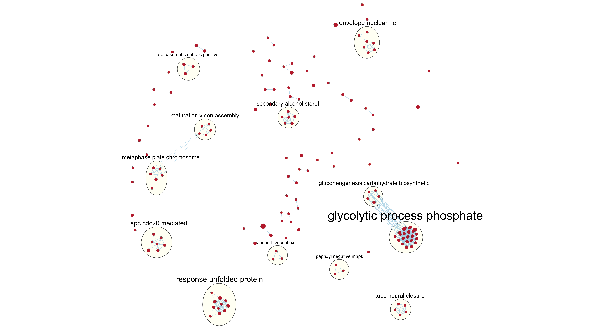
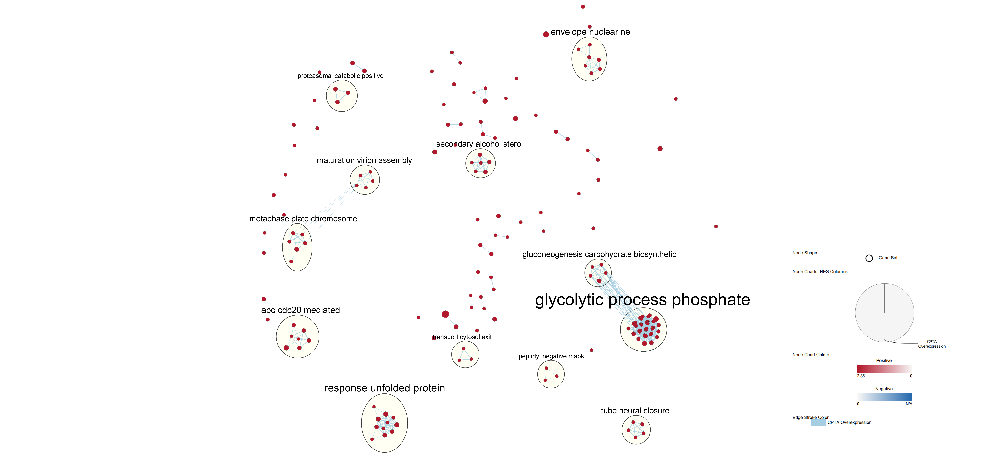
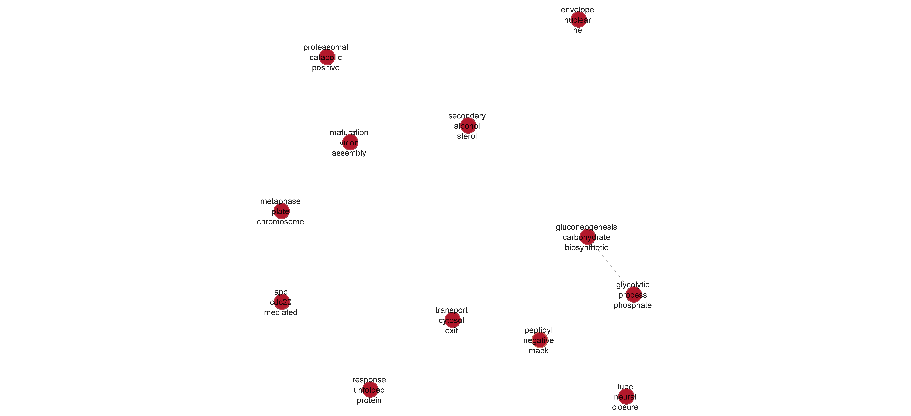

Name: Yuzi Li  
Student Number: 1005131947  
Journal Entry: [Assignment 3 Journal](https://github.com/bcb420-2022/Yuzi_Li/wiki/7.-Assignment-3:-Data-set-pathway-and-network-analysis)

***

# Summary of results from assignments 1 and 2

Data was downloaded from GEO with id GSE161243. Two gene expression experiments were conducted in the study, one on identifying the effect of CPT1A gene knockdown in LNCaP-C4-2 prostate cancer cells, the other identifying the effect of CPT1A gene overexpression in prostate cancer cells. The replicates of the same control/test conditions are assigned the same cell_type in the samples data frame: “KD_C”, “KD_S”, “OE_C”, “OE_S”, with “KD” standing for knockdown and “OE” standing for overexpression. “_C” are control samples, and “_S” are experimental samples. These 4 different cell types were indicated for TMM normalization.  

Data was filtered and then normalized using TMM normalization, and sample variance was visualized using an MDS plot. The sample groups data appear to be well separated, and there appears to be low technical variation.  

Differential gene expression analysis was conducted using BH correction. I used the benjamini-hochberg method for p-value correction because it is not overly stringent and is the standard method. 

From thresholded over-representation analysis by G:Profiler, I see that in the CPT1A knockdown experiment, many up-regulated genes in CPT1A knockdown cells are involved in different mitosis-related events as well as cell cycle checkpoint signaling. Specifically, I noticed that some of these genes are involved in double-strand breaks repair and break-induced replication. Down-regulated genes in CPT1A knockdown cells are more related to amino acid biosynthesis and positive regulations on translation and transcription in response to stress.  

In the CPT1A overexpression cells, many up-regulated genes are associated with regulation of ubiquitin-mediated protein catabolism and energy metabolism (glycolysis, gluconeogenesis, etc.). Processes like ribosome production and translation are down-regulated in CPT1A overexpression cells.  

***

<br> <br>

# Non-thresholded gene set enrichment analysis

First, I installed some related packages:  

```{r, eval=FALSE, message=FALSE, warning=FALSE}
#install required R and bioconductor packages
tryCatch(expr = { library("RCurl")}, 
         error = function(e) {  install.packages("RCurl")}, 
         finally = library("RCurl"))
#use library
tryCatch(expr = { library("ggplot2")}, 
         error = function(e) { install.packages("ggplot2")}, 
         finally = library("ggplot2"))
#use easy cyRest library to communicate with cytoscape.
tryCatch(expr = { library("RCy3")}, 
         error = function(e) { BiocManager::install("RCy3")}, 
         finally = library("RCy3"))
```

Then, I prepared the non-thresholded gene lists for both CPT1A knockdown and overexpression experiments using the following code: 

```{r, eval=FALSE, message=FALSE, warning=FALSE}
qlf_hits_kd[,"rank"] <- -log(qlf_hits_kd$PValue, base=10) * sign(qlf_hits_kd$logFC)
qlf_hits_oe[,"rank"] <- -log(qlf_hits_oe$PValue, base=10) * sign(qlf_hits_oe$logFC)

write.table(x=data.frame(genename=row.names(qlf_hits_kd),F_stat=qlf_hits_kd$rank), 
            file='cpt1a_kd.rnk',sep = '\t', 
            row.names = FALSE,col.names = FALSE,quote = FALSE)
write.table(x=data.frame(genename=row.names(qlf_hits_oe),F_stat=qlf_hits_oe$rank), 
            file='cpt1a_oe.rnk',sep = '\t', 
            row.names = FALSE,col.names = FALSE,quote = FALSE)
```

<br>

### GSEA analysis

I used GSEA for non-thresholded gene set enrichment analysis because we learned to use this in a previous homework assignment, and GSEA is very user-friendly and lets users specify custom genesets as well as other detailed settings.  
Settings used:  

* Gene sets: genesets from the baderlab geneset collection from March 1, 2021 containing GO biological process, no IEA and pathways.
* Version: GSEA version 4.2.3
* Gene set size limits: maximum geneset size of 200, minimum geneset size of 15
* Gene set permutation: 1000 permutations

Ran the GSEA analysis in R using the following code:  

```{r, eval=FALSE, message=FALSE, warning=FALSE}
gsea_jar <- '/home/rstudio/GSEA_4.2.3/gsea-cli.sh'
java_version <- '11'
working_dir <- getwd()
analysis_name_oe <- 'cpt1a_oe'
analysis_name_kd <- 'cpt1a_kd'
rnk_file_oe <- "cpt1a_oe.rnk"
rnk_file_kd <- "cpt1a_kd.rnk"
dest_gmt_file <- 'Human_GOBP_AllPathways_no_GO_iea_March_01_2021_symbol.gmt'

command <- paste("", gsea_jar,  "GSEAPreRanked -gmx", dest_gmt_file, "-rnk", 
                 file.path(working_dir, rnk_file_oe), "-collapse false -nperm 1000 -scoring_scheme weighted -rpt_label ",
                 analysis_name_oe,"  -plot_top_x 20 -rnd_seed 12345  -set_max 200 -set_min 15 -zip_report false -out" ,
                 working_dir, " > gsea_output.txt",sep=" ")
system(command)
command <- paste("", gsea_jar,  "GSEAPreRanked -gmx", dest_gmt_file, "-rnk", 
                 file.path(working_dir, rnk_file_kd), "-collapse false -nperm 1000 -scoring_scheme weighted -rpt_label ",
                 analysis_name_kd,"  -plot_top_x 20 -rnd_seed 12345  -set_max 200 -set_min 15 -zip_report false -out" ,
                 working_dir, " > gsea_output.txt",sep=" ")
system(command)
```

<br>

### Enrichment results summary

Top gene sets returned for CPT1A overexpression:  

* Top up-regulated gene set: IRE1alpha activates chaperones, from Reactome R-HSA-381070  
  + p-value: 	0.000  
  + ES: 0.72  
  + NES: 2.36	  
  + FDR: 	0.000  
  + Number of genes in leading edge: 31  
  + Top gene associated with gene set: SYVN1 (synoviolin 1)  
* Top down-regulated gene set: Homologous DNA Pairing and Strand Exchange, from Reactome R-HSA-5693579  
  + p-value: 	0.000
  + ES: -0.59
  + NES: 	-1.96
  + FDR: 	0.248
  + Number of genes in leading edge: 22
  + Top gene associated with gene set: ATM (ATM serine/threonine kinase)  
Top gene sets returned for CPT1A knockdown:  
* Top up-regulated gene set: HALLMARK E2F TARGETS from MSIGDB_C2 HALLMARK_E2F_TARGETS
  + p-value: 0.000
  + ES: 0.6979937
  + NES: 2.9647112
  + FDR: 0.000
  + Number of genes in leading edge: 82
  + Top gene associated with gene set: PLK1 (polo like kinase 1)
* Top down-regulated gene set: L13a-mediated translational silencing of Ceruloplasmin expression from Reactome R-HSA-156827
  + p-value: 	0.000
  + ES: 	-0.7955503
  + NES: -3.5532935
  + FDR: 	0.000
  + Number of genes in leading edge: 81
  + Top gene associated with gene set: EIF3E (eukaryotic translation initiation factor 3 subunit E)

<br>

### Comparison to results from thresholded over-representation analysis

For up-regulated gene sets in CPT1A overexpression:  

* IRE1alpha activates chaperones is also seen in thresholded analysis as the second top hit from Reactome. This means that the GSEA results mainly agrees with the G:Profiler results. 

For down-regulated gene sets in CPT1A overexpression:  

* Homologous DNA Pairing and Strand Exchange pathway gene set is down-regulated. This is a pathway involved in homologous recombination. But homologous recombination is not seen in the thresholded over-representation analysis results, so this is a surprising finding. However, gene sets like cytoplasmic translation initiation is present as other top hits from the non-thresholded analysis, agreeing with results from thresholded analysis, in which the top hits for down-regulated gene sets in CPT1A overexpression are mainly concerned with ribosome production and translation. 

For up-regulated gene sets in CPT1A knockdown:  

* The MSIGDB_C2 database was not included in the thresholded analysis, so there is no genesets from the previous analysis that match exactly with the top up-regulated geneset returned here from MSIGDB_C2 (HALLMARK_E2F_TARGETS). However, HALLMARK_E2F_TARGETS contains genes encoding cell cycle related targets of E2F transcription factor, which is mainly involved in control of the G1/S transition by transcriptionally activating genes needed for DNA replication. This matches the top hits from thresholded analysis, as most gene sets returned in the thresholded analysis are related to DNA replication and G1/S transition control. 
* The top gene associated with this HALLMARK_E2F_TARGETS geneset is PLK1 (polo like kinase 1), which also appears to be related to top hits from thresholded analysis as one of the top hits from Reactome from thresholded analysis was polo like kinase-mediated events. 

For down-regulated gene sets in CPT1A knockdown:  

* L13a-mediated translational silencing of Ceruloplasmin expression is also seen in thresholded analysis as top hits from Reactome. This means that the GSEA results mainly agrees with the G:Profiler results. 

While most results from non-thresholded analysis agrees with the ones from thresholded analysis and are straightforward to compare, some top gene sets are not seen before in the thresholded results. This sometimes is due to the fact that different pathway datatbases were used. When the non-thresholded analysis returns top hits from MySigDB, which is not included in the thresholded analysis, it might be a bit harder to compare the results as the gene set descriptions can be quite different. However, upon further inspection, most top hits do agree with the thresholded results. A few surprising hits can also come up in the non-thresholded analysis, possibly because the strict threshold used in thresholded analysis is excluding too many genes than it should. 

***

<br> <br>

# Cytoscape visualization of gene set enrichments

I will only do analysis on the CPT1A Overexpression experiement in the following sections as the article focused more on the overexpression experiment, not the knockdown.  

<br>

### Creating an enrichment map

**How many nodes and how many edges in the resulting map? **  
There are 167 nodes and 750 edges in the CPT1A Overexpression enrichment map.  

**What thresholds were used to create this map? **  

* FDR cutoff: 0.1
* p-value cutoff: 1.0
* Edges similarity coefficient cutoff: 0.375 (using the Jaccard + Overlap combined metric)

 

<br>

### Network annotation

I set the maximum number of annotations to 12 because I do not want to annotate the clusters that are too small. This way it is computationally less expensive and also gives a clearer focus to the map.  

 

 

<br>

### Publication-ready figure

I created this figure by checking the publication-ready option in the Enrichment Map panel and then exporting the image. I also pasted the legend to the bottom right corner.  

 

<br>

### Collapsing to a theme network

I used the "Create summary network" function in autoannotate to create the theme network, in which only the collapsed clusters are included (all other nodes are ignored).  

 

***

<br> <br>

# Results interpretations

**Do the enrichment results support conclusions or mechanism discussed in the original paper? How do these results differ from the results you got from Assignment #2 thresholded methods**  

It indirectly supports the conclusions of the original paper. The original paper concludes that CPT1A overexpression increases mitochondrial ROS, and here we can see some downstream pathways affected, such as unfolded protein response and proteasomal catabolism, both of which also seen in the results from assignment 2 thresholded methods.  

Many other enriched gene sets came up here are also seen in the thresholded analysis, such as glycolytic process and gluconeogenesis (the 2 major clusters of enriched pathways). Some unexpected clusters of gene sets that are not seen in the thresholded analysis also came up, such as neural tube closure and maturation virion assembly.  

**Can you find evidence, i.e. publications, to support some of the results that you see. How does this evidence support your result?**  

Palmitoylation of some viral proteins are essential for virion assembly, as discovered by multiple research groups (Veit 2012, Sobocińska et al. 2018). Because CPT1A is essential for beta oxidation, fatty acid biosynthesis is affected by overexpression of CPT1A, this could potentially cause the cells to produce more palmitoyl-CoA, which helps increase palmitoylation of some viral proteins.  

<br>

### Post analysis using approved drugs

As mentioned in the article, CPT1A has been identified as a potential therapeutic target for a growing list of cancers. Therefore I chose the approved drugs gene sets to investigate which pathways up-regulated by CPT1A overexpression can be targeted by drugs.  

 

 

***

<br> <br>

# Citations

Zhu Y, Davis S, Stephens R, Meltzer PS, Chen Y (2008). “GEOmetadb: powerful alternative search engine for the Gene Expression Omnibus.” Bioinformatics (Oxford, England), 24(23), 2798–2800.  
Chen Y, Lun AAT, Smyth GK (2016). “From reads to genes to pathways: differential expression analysis of RNA-Seq experiments using Rsubread and the edgeR quasi-likelihood pipeline.” F1000Research, 5, 1438.  
Durinck S, Moreau Y, Kasprzyk A, Davis S, De Moor B, Brazma A, Huber W (2005). “BioMart and Bioconductor: a powerful link between biological databases and microarray data analysis.” Bioinformatics, 21, 3439–3440.  
Isserlin R (2022). “BCB420 lectures”. University of Toronto.  
Gu Z, Eils R, Schlesner M (2016). “Complex heatmaps reveal patterns and correlations in multidimensional genomic data.” Bioinformatics.  
Gu Z, Gu L, Eils R, Schlesner M, Brors B (2014). “circlize implements and enhances circular visualization in R.” Bioinformatics, 30, 2811-2812.  
Stankovic-Valentin, N., & Melchior, F. (2018). Control of Sumo and ubiquitin by ROS: Signaling and disease implications. Molecular Aspects of Medicine, 63, 3–17. https://doi.org/10.1016/j.mam.2018.07.002  
Miguel, V., Tituaña, J., Herrero, J. I., Herrero, L., Serra, D., Cuevas, P., Barbas, C., Puyol, D. R., Márquez-Expósito, L., Ruiz-Ortega, M., Castillo, C., Sheng, X., Susztak, K., Ruiz-Canela, M., Salas-Salvadó, J., González, M. A., Ortega, S., Ramos, R., & Lamas, S. (2020). Renal tubule CPT1A overexpression protects from kidney fibrosis by restoring mitochondrial homeostasis. https://doi.org/10.1101/2020.02.18.952440  
Benjamini, Y., & Hochberg, Y. (1995). Controlling the false discovery rate: A practical and powerful approach to multiple testing. Journal of the Royal Statistical Society: Series B (Methodological), 57(1), 289–300.  
Merico, D., Isserlin, R., Stueker, O., Emili, A., & Bader, G. D. (2010). Enrichment map: A network-based method for gene-set enrichment visualization and interpretation. PloS One, 5(11), e13984.  
Veit, M (2012). “Palmitoylation of virus proteins.” Biology of the cell, 104(9): 493-515.  
Sobocińska J, Roszczenko-Jasińska P, Ciesielska A, Kwiatkowska K (2018). “Protein Palmitoylation and Its Role in Bacterial and Viral Infections.” Frontiers in Immunology, 8, 1664-3224.  


